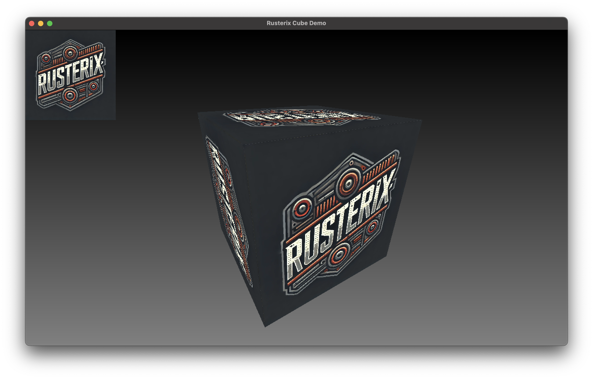
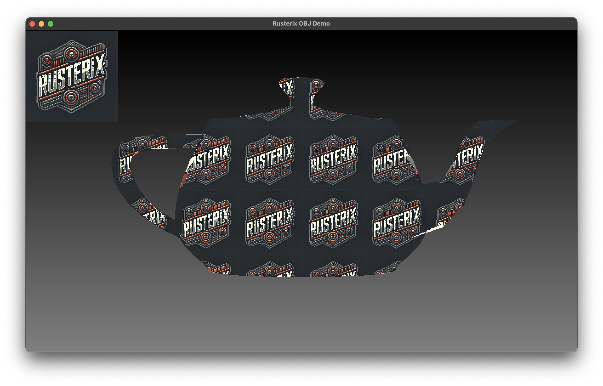

Rusterix is a fast software renderer for 2D and 3D triangles and lines. Its goals are to provide an easy and portable alternative to hardware rasterization for retro and low-poly games.

---

## How it works

Rusterix uses a multi-threaded, tile-based renderer and organizes 2D and 3D meshes into batches. It precomputes the bounding boxes and triangle edges for each batch during projection.

The main goal is to achieve a single rendering pass to maximize parallelization. The batching system makes this possible while also enabling grouping and optimizations for individual objects and content.

Because of these optimizations, Rusterix is not a general-purpose abstraction of a hardware rendering pipeline (for that, consider using the excellent [euc](https://github.com/zesterer/euc)). Instead, it features a custom pipeline specifically optimized for software rendering and operates within a fixed color space.

Rendering a rectangle and a 3D cube is as easy as:

```rust
// Create a scene with a static 2D rectangle and a box
let scene = Scene::from_static(
    vec![Batch::from_rectangle(0.0, 0.0, 200.0, 200.0)],
    vec![Batch::from_box(-0.5, -0.5, -0.5, 1.0, 1.0, 1.0).sample_mode(SampleMode::Nearest)],
)
.background(Box::new(VGrayGradientShader::new())); // Apply a background shader

// Textures needed by the scene
let textures = vec![Texture::from_image(Path::new("images/logo.png"))];

// Create a camera
let camera = D3OrbitCamera::new();

let width = 800;
let height = 600;
let mut pixels = vec![0; width * height * 4];

// Create the view projection camera matrix
let projection_matrix_3d = camera.view_projection_matrix(
    75.0, // Fov
    width as f32,
    height as f32,
    0.1, // Near plane
    100.0, // Far plane
);

// Rasterize the scene
Rasterizer {}.rasterize(
    &mut scene,
    pixels,
    width,
    height,
    80, // Tile size for parallelization
    None, // No 2D projection matrix
    projection_matrix_3d,
    &self.textures,
);
```

## Goals and Status

Once finished, you will be able to use Rusterix in several different ways:

* As a library to rasterize 2D and 3D meshes, WIP. See the `Cube` and `Obj` examples.
* As a retro game engine with text driven editors for Doom like maps. Programmable in Rust and an inbuild scripting system (TBD).

My goals for both of these use cases:

* Fast software based rendering.
* Procedural materials and particles for in game effects and content.
* Texture based and procedural entities / characters.

## Implemented Features

* Fast software-based rendering.
* Supports batches of 2D and 3D geometry, each with configurable parameters (e.g., DrawMode, SamplingMode, CullingMode, RepeatMode, TextureIndex, etc.).
* Shaders can be applied to the screen or individual batches.

## Motivation

I use `rusterix` as the rendering engine for my [Eldiron](https://github.com/markusmoenig/Eldiron) project. But it makes sense to split it out into a re-usable library and engine.

## Examples

To execute an example just do something like ```cargo run --release --example cube```.

* **cube** displays a textured cube. 

* **obj** demonstrates how to load and display an obj file. 

## Disclaimer

Rusterix is an independent project and is not affiliated with or endorsed by the Rust programming language team or the Rust Foundation. All trademarks are the property of their respective owners.

## License

`rusterix` is distributed under either of:

- Apache License, Version 2.0, (LICENSE-APACHE or http://www.apache.org/licenses/LICENSE-2.0)

- MIT license (LICENSE-MIT or http://opensource.org/licenses/MIT)

at the discretion of the user.
